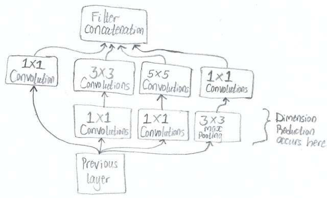
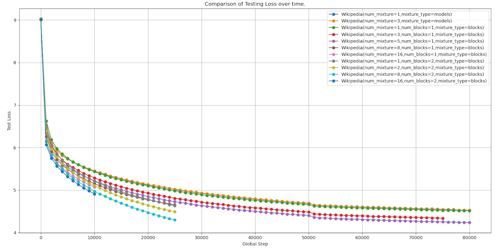

# Transformer Mixture Models
## Description
This is a novel (as far as i know) implementation of mixture models applied to a transformer model that draws inspiration from [Gaussian Mixture Model](https://brilliant.org/wiki/gaussian-mixture-model/) (GMM) algorithm (not 100% exact), [Stacking Ensemble](https://arxiv.org/abs/2104.02395) algorithm, and [Inception module](https://arxiv.org/abs/1409.4842). The idea is to use multiple transformer models stacked together (side by side) and force them to focus on different aspects of the same input. The model's output will then be aggregated and either passed to a classifier layer or treated as the final output. Each model is independent from the other and no communication occurs between them, however they all should act as one large model (Mixture). The aim of such an approach is to scale the model without increasing model depth (number of layers), increasing the dimensions of the intermediate feed-forward layers, or resorting to using techniques such as [Mixture of Experts](https://arxiv.org/abs/2407.06204) (MoE), and their variants. Also the stacking is not performed as a layer inside one model as most model implementations do but rather as an ensemble of neural network models, because why not.

## Theory (Why i think it works)
A Gaussian mixture model is a probabilistic model that assumes all the data points in a dataset are generated from a mixture of a finite number of Gaussian distributions with unknown parameters (component weights, mean and variances/covariances). By utilizing multiple simpler Gaussian distributions (unimodal) and [Expectation–maximization](https://en.wikipedia.org/wiki/Expectation%E2%80%93maximization_algorithm) algorithm one could cluster the data points. They are also used for tasks such as density estimation. The whole idea being a single Gaussian distribution isn't able to to do the job well by utilizing a mixture of them, it's able to do so.

<p align="center">
  
</p>

Ensemble learning is a machine learning technique that aggregates two or more models/learners in order to improve overall performance. One of the techniques to do this is called Stacking. Stacking involves using multiple learners that employ different algorithms such as KNN, Decision trees, etc, called base learners. They are all trained on the same dataset at first. After training, they are made to make predictions on an unseen dataset, held out during training, which are then aggregated and passed to a new model called the meta learner, that's trained to make the final prediction. This is called meta-learning.

<p align="center">
  
</p>

An inception module was a technique used for Computer Vision tasks (usually utilizes [Convolutional Neural Networks](https://en.wikipedia.org/wiki/Convolutional_neural_network) ) to increase the depth and width of a network while keeping the computational budget constant i.e keep the number of operations constant but adding more layers. The idea was that in order to improve the performance of a model was to increase the model size by either increasing the depth (adding more layers) or increasing width (number of "units" in each layer). The downsides of such an apprach was that it made the model more prone to overfitting where dataset size is small and it also dramatically increased use of computational resources. To address this, the inception module was introduced where the inputs dimension of the input are reduced and processed by stacked layers before finally being concatenated alongside their channels dimension for the next layer. The main benefits of doing it this way was it allowed for the increase in number of layers without a dramatic rise in computational complexity. This is mostly due to the dimension reduction in the module.

<p align="center">
  
</p>

Neural Networks are considered to be [universal function approximators](https://en.wikipedia.org/wiki/Universal_approximation_theorem), where given an input in the form of a vector or matrix such as in images, they will transform (affine trasformation) the input into a form suitable for a given task e.g multi class classification. This is done by utilizing numerous operations such as matrix multiplication, bias addition, non-linear activations, etc., that can be grouped together to form a layer. The intermediary vectors can be visuallized in a feature space, which is an abstract space where each dimension represents a learned feature from the dataset. The capability of the neural network can be determined by the number of layers of the model (depth) or the size of the intermediary vectors, controlled by matrix weights in the matrix multiplication operation (width). The bigger the model the more capable it is, however it comes with more computation complexity and a high likelihood of performing poorly with limited dataset, overfitting.

In each layer the dimensions of the intermediary vectors in a neural network can be manipulated in two ways:
- Increasing the dimension size which expands feature space (adds more information / increases expressiveness).
- Decreasing the dimension size which compresses feature space (removes redundant information/ limits expressiveness).

This project aims to combine the mentioned concepts (GMM, Stacking Ensemble, and Inception Module) in such a manner that allows a neural network model, in this case a Transformer model to scale without needing to increase the depth or width. The idea is to stack multiple models (side by side), where they all act as a mixture. The outputs of each model are concatenated together and either treated as the final output or passed to a shared layer for final prediction. The concatenation operation ensures that each model's output is treated as independent as they represent unique features independent from the others. Theoretically this should mean the performance of the mixture models should improve as the representational capacity of the mixture is greater than that of a single model, while not needing to utilize complicated training algorithms like those in [Sparse Mixture of Experts](https://arxiv.org/abs/1701.06538) (MoE).

<p align="center">
  
</p>

## Implementation
The project includes the following scripts and code:
- Script to generate Vocabulary dictionary.
- Script to generate subword dataset using Vocabulary.
- Script to generate train/test dataset.
- Script to generate testing loss .csv file using model checkpoints.
- Script to graph testing loss dataset from testing loss .csv files.
- Code to train model.

## Requirements
- Anaconda (Optional)
- Python 3

## Installing.
1. (Optional) Install [Anaconda](https://docs.anaconda.com/) on your machine.
    - Create anaconda environment:
    ```
    conda create --name <env_name> python=3.12
    ```
    - To activate anaconda environment, if not already activated:
    ```
    conda activate <env_name>
    ```
2. (If not installed) Install [Pytorch 2.5](https://pytorch.org/get-started/locally/) based on your hardware requirements and preferences.
3. Install Python depencies:
    ```
    pip install -r requirements.txt
    ```

## Dataset Creation (Needs to be run once)
Dataset used was [Plain Text Wikipedia 2020-11](https://www.kaggle.com/datasets/ltcmdrdata/plain-text-wikipedia-202011). Once downloaded, the json file was converted to raw plain-text files and all the Non-Latin characters like Greek symbols was removed (simplified the dataset). Script used for both operations are not provided!

### Generating vocabulary.
To generate vocabulary .json file, run the following (Needs to be generated first then subword dataset):
```
python scripts/generate_vocabulary.py --device <Device to run model on> --dataset-path <File path to .txt file for sample dataset> --vocab-size <Size of vocab dictionary> --out-path <Folder path to store vocab dictionary>
```

### Generating subword dataset.
To generate subword dataset you need a .csv file listing all raw .txt files, run the following to generate a .json dataset file.
```
python scripts/generate_subword_dataset.py --device <Device to run model on> --dataset-path <Filepath to csv file> --vocab-path <Filepath to vocab json file> --out-path <Folder path to store outputs>
```

### Generating train/test dataset.
To generate the train/test dataset to be used for training model, run the following:
```
python scripts/generate_training_dataset.py --sliding-window <Context window size of dataset> --stride <Stride value to determine overlap of context window> --tr-dataset-path <Filepath to csv file containing list of .txt files for train dataset> --tst-dataset-path <Filepath to csv file containing list of .txt files for test dataset> --out-path <Folder path to store outputs>
```

## Training model.
To train the model, one first needs a config.json file (Example can be found in training_results/Misc/example_config.json), then run the following:
```
python train_mixture_models.py --device cuda --vocab-dataset-path <Filepath to vocab json file> --tr-dataset-path <Filepath to csv file containing list of .txt files for train dataset> --tst-dataset-path <Filepath to csv file containing list of .txt files for test dataset> --batch-size <Batch-size num> --config-path <Filepath to .json config file> --lr-steps <Step before updating learning rate using gamma value from config> --checkpoint-steps <Steps for checkpointing and/or testing model> --out-dir <Folder path to store outputs> --model-checkpoint <File path to model checkpoint to load from (if any)> --load-optim <Load model's optimizer's weights and parameters, if loading model> --use-activation-checkpoint <Use activation checkpointing to trade computation speed for more memory>
```

## Results
Models were trained on an **RTX 3080** 10GB GPU. (For better quality images, script to chart losses from .csv files and other miscellaneous files go to **training_results/** folder)

<p align="center">
  
</p>

## Interpretation
Two types of mixtures was tested:
- Mixture of models
- Mixture of blocks

### Mixture of Models
Here the models output were treated as probability classes split amongst each other, they were trained with a mixture of 1 and 3 models.

Observation: No improvement was observed.

In conclusion: this arrangement doesn't work.

### Mixture of Blocks
Here the multiple layers precedding the classifier layer were grouped together to form a "block", where each "block" had it's own Embedding layer, Positional Encoding layer and N transformer layers (Self-Attention and Feed forward layers). Each "block" outputs a small vector, determined beforehand by dividing the desired vector dimension with the number of mixtures of "blocks". A concatenation operation is performed on all the vector outputs from each "block" to form the concatenated output and this is passed to the shared classifier layer.

Depth of transformer layers used was between 1 and 2, and number of mixtures of blocks used were 1, 2, 3, 5, 8, and 16 with some discrepancies in training steps.

Observation: As the number of mixtures kept increasing, for all depth sizes tested, the model performed better (testing loss got lower). Some notable dimishing returns was observed when going from 8 to 16 mixtures, which should be expected as other factors like model depth became the limiting factor. It should be noted that, in some cases, shallow models (depth=1) with higher number of mixtures outperformed deeper models (depth=2) with no mixtures, i.e baseline models. 

In conclusion: Seems to work well, up to a point. Needs to be tested at scale to see if trend holds. Also may benefit a lot from distributed setups.

## Additional Relevant Links.
- [Attention Is All You Need](https://arxiv.org/abs/1706.03762)
- [Ensemble deep learning: A review](https://arxiv.org/abs/2104.02395)
- [Scaling Laws for Neural Language Models](https://arxiv.org/abs/2001.08361)
